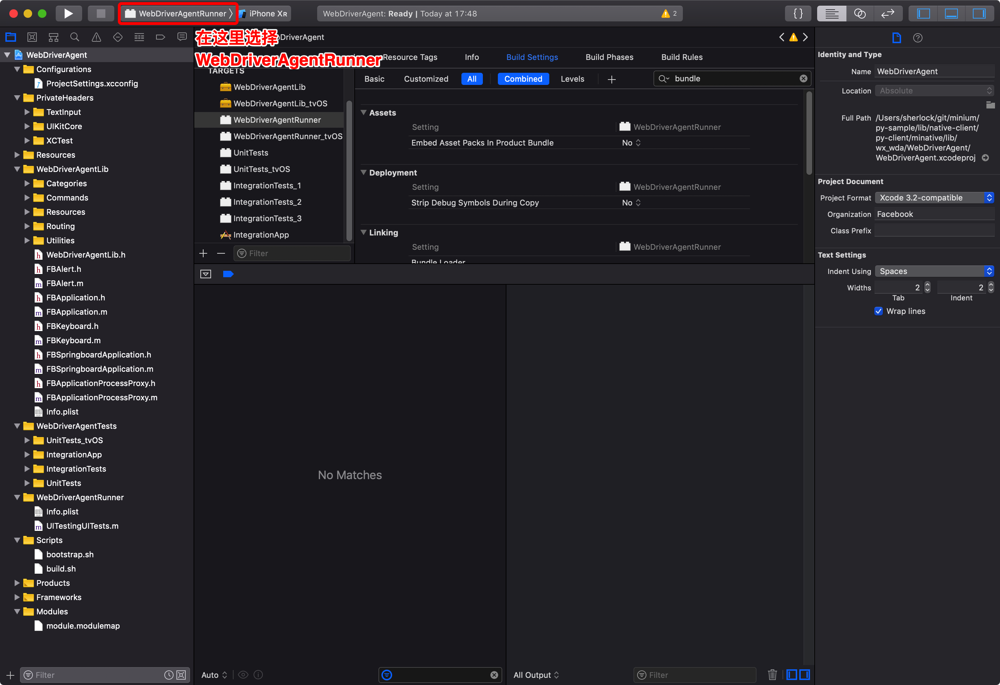

# 真机测试

minium通过配置文件来识别小程序运行的平台，如果需要测试手机上的小程序，那么需要把配置项`platform`改成Android或者iOS。

?> 目前我们连接手机的方式是复用IDE[远程调试](https://developers.weixin.qq.com/miniprogram/dev/devtools/remote-debug.html)的通道，我们通过IDE拿到二维码，然后推送到手机上，手机通过识别二维码跟IDE建立连接。后续我们会优化这个方式。

## Android

Android需要保证命令行能识别到手机设备
```
$ adb devices
List of devices attached
28fb61d0ef1c7ece	device
```
如果只有一台手机在线，那么只需要把`platform`配置成`Android`即可， 而如果多台设备连接到手机，配置文件需要制定设备的序列号，如:

```
{
  "debug_mode": "debug",
  "enable_app_log": false,
  "platform": "Android",
  "device_desire": {
    "serial": "28fb61d0ef1c7ece"
  }
}
```
?> 在我们连接真机的时候，Android手机安装微信测试的apk，有些手机在安装过程中会弹框或者输入密码，所以第一次运行的时候可能需要人为的处理

## IOS

### 安装 libmobiledevice

```shell
brew uninstall ideviceinstaller
brew uninstall libimobiledevice
brew install --HEAD libimobiledevice
brew link --overwrite libimobiledevice
brew install ideviceinstaller
brew link --overwrite ideviceinstaller
```

如果没有安装过直接 brew install ideviceinstaller 即可。

当然你也可以本地编译：

```shell
git clone https://github.com/libimobiledevice/libimobiledevice.git
cd libimobiledevice
./autogen.sh --disable-openssl
make
sudo make install
```

### 配置 WebDriverAgent

minium 不包含 WebDriverAgent（简称wda） 工程，请到[appium/WebDriverAgent](https://github.com/facebookarchive/WebDriverAgent) clone 最新版本，只需要简单配置两个选项即可




配置完成之后，可以用`⌘+u`快捷键运行 unit test 测试 wda 是否正常运行


更加详细的配置说明请访问[appium/WebDriverAgent/wiki](https://github.com/facebookarchive/WebDriverAgent/wiki/Starting-WebDriverAgent)

### 配置测试 config.json

在用例目录下面新增一个叫`config.json`的配置文件，格式如下

```json
{
  "platform": "iOS",
  "device_desire":{
    "wda_project_path": "/Users/sherlock/github/appium/WebDriverAgent", //自定义 wda 的路径
    "device_info": {
          "udid": "aee531018e668ff1aadee0889f5ebe21a2292...", //手机的 udid 
          "model": "iPhone XR",
          "version": "12.2.5",
          "name": "sherlock's iPhone"
    }
  }
}
```

!> ***PS: JSON不支持注释，请把“//”以及后面的内容删掉***

> 详细说明请看：[测试配置](minium/Python/framework/config)